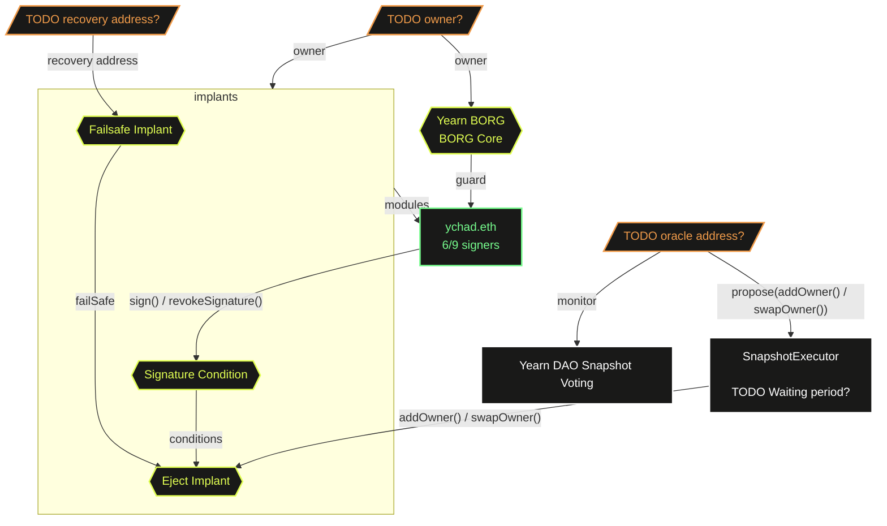

# Yearn BORG

## BORG Architectures

## Member Management Voting Workflow

Example below demonstrates adding `alice` as a new signer to `ychad.eth`.

1. DAO proposes to add `alice` to `ychad.eth`
2. Once passed on Snapshot voting, `oracle` calls `SnapshotExecutor.propose(addOwner(alice))`
3. `ychad.eth` does one of the following:
   - To approve it, call `SignatureCondition.sign()` if not yet done
   - To reject it, call `SignatureCondition.revokeSignature()` if not yet done
3. Once `ychad.eth` approved and the proposal waiting period is passed, any can call `SnapshotExecutor.execute(proposalId)`
4. `alice` is now added to `ychad.eth`
