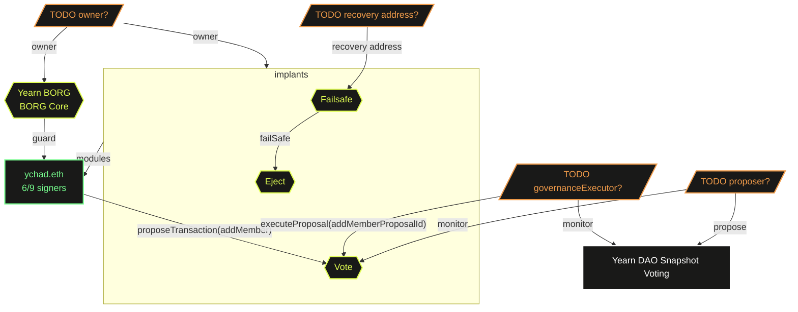

# Yearn BORG

## BORG Architectures

```mermaid
graph TD
   ychad[ychad.eth<br/>6/9 signers]
   yearnDaoVoting[Yearn DAO Snapshot Voting]
   govExecutor[/TODO governanceExecutor?/]
   snapshotProposer[/TODO proposer?/]
   
   %% TODO TBD
   tempOwner[/TODO owner?/]
   recoveryAddr[/TODO recovery address?/]
   
   borg{{Yearn BORG<br>BORG Core}}
   
   subgraph implants
       failSafeImplant{{Failsafe}}
       ejectImplant{{Eject}}
       voteImplant{{Vote}}
   end

   ychad -->|"proposeTransaction(addMember)"| voteImplant
   
   govExecutor -->|monitor| yearnDaoVoting  
   
   snapshotProposer -->|monitor| voteImplant
   snapshotProposer -->|propose| yearnDaoVoting  
   
   borg -->|guard| ychad
   
   implants -->|modules| ychad
   
   failSafeImplant -->|failSafe| ejectImplant
   
   tempOwner -->|owner| borg
   tempOwner -->|owner| implants
   
   recoveryAddr -->|recovery address| failSafeImplant
   
   govExecutor -->|"executeProposal(addMemberProposalId)"| voteImplant
   
   %% Styling (optional, Mermaid supports limited styling)
   classDef default fill:#191918,stroke:#fff,stroke-width:2px,color:#fff;
   classDef borg fill:#191918,stroke:#E1FE52,stroke-width:2px,color:#E1FE52;
   classDef safe fill:#191918,stroke:#76FB8D,stroke-width:2px,color:#76FB8D;
   classDef todo fill:#191918,stroke:#F09B4A,stroke-width:2px,color:#F09B4A;
   class borg borg;
   class failSafeImplant borg;
   class ejectImplant borg;
   class voteImplant borg;
   class ychad safe;
   class tempOwner todo;
   class recoveryAddr todo;
   class govExecutor todo;
   class snapshotProposer todo;
```
