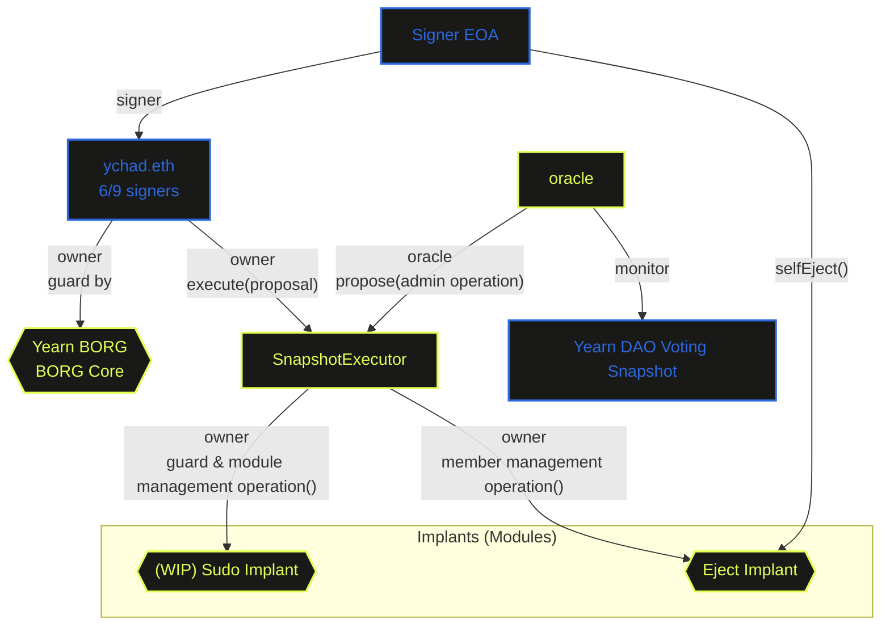

# Yearn BORG

## BORG Architectures (TBD)



## Restricted Admin Workflows (TBD)

`ychad.eth` will be prohibited from unilaterally performing the following admin operations:

- Add / remove / swap signers
- Set Guards
- Add / disable Modules

Except existing signers, Guard (BORG Core) and Modules (BORG Implants), 
all coming operations as listed above will require approval of both `ychad.eth` and DAO, with process as such:

1. Operation is initiated on the MetaLeX OS webapp
2. A Snapshot proposal will be submitted via API using Yearn's existing voting settings
3. MetaLeX's Snapshot oracle will submit the results onchain to an executor contract (`SnapShotExecutor`), which will have the proposed transaction pending for co-approval
4. `ychad.eth` will approve by executing the operation through the MetaLeX OS webapp

## Key Parameters

| ID                             | Value      | Descriptions                                            |
|--------------------------------|------------|---------------------------------------------------------|
| `borgIdentifier`               | Yearn BORG | BORG name                                               |
| `borgMode`                     | blacklist  | Every operation is allowed unless blacklisted           |
| `borgType`                     | 3          |                                                         |
| `snapShotWaitingPeriod`        | 3 days     | Waiting period before a proposal can be executed        |
| `snapShotCancelPeriod`         | 2 days     | Extra waiting period before a proposal can be cancelled |
| `snapShotPendingProposalLimit` | 3          | Maximum pending proposals                               |
| `oracle`                       | `address`  | MetaLeX Snapshot oracle                                 |

## Deployment

1. Run the deploy script
   ```bash
   forge script scripts/yearnBorg.s.sol --rpc-url <RPC URL> --optimize --optimizer-runs 200 --use solc:0.8.20 --via-ir --broadcast
   ```

2. If got the following errors, force clean the cache with flag `--force`
   ```
   Error: buffer overrun while deserializing
   ```      
   
3. Take notes of the output Safe TXs (for setting guard & adding modules), for examples:
   ```
   Safe TXs:
    # 0
      to: 0xFEB4acf3df3cDEA7399794D0869ef76A6EfAff52
      value: 0
      data:
   0x610b5925000000000000000000000000777b947b1821c34ee94d7d09c82e56f8008a0e08

    # 1
      to: 0xFEB4acf3df3cDEA7399794D0869ef76A6EfAff52
      value: 0
      data:
   0xe19a9dd9000000000000000000000000bc19387f5b8ae73fad41cd2294f928a735c60534
   ```   
4. Ask `ychad.eth` to sign and execute the Safe TXs 

## Tests

### Integration Tests

Test the deployment scripts and verify the results.

```bash
forge test --optimize --optimizer-runs 200 --use solc:0.8.20 --via-ir --fork-url <eth-mainnet-archive-endpoint> --fork-block-number 22268905 --mc YearnBorgTest   
```

### Acceptance Tests

Verify a specific deployment results.

```bash
forge test --optimize --optimizer-runs 200 --use solc:0.8.20 --via-ir --fork-url <eth-mainnet-archive-endpoint> --fork-block-number <deployment-block-number> --mc YearnBorgAcceptanceTest   
```
