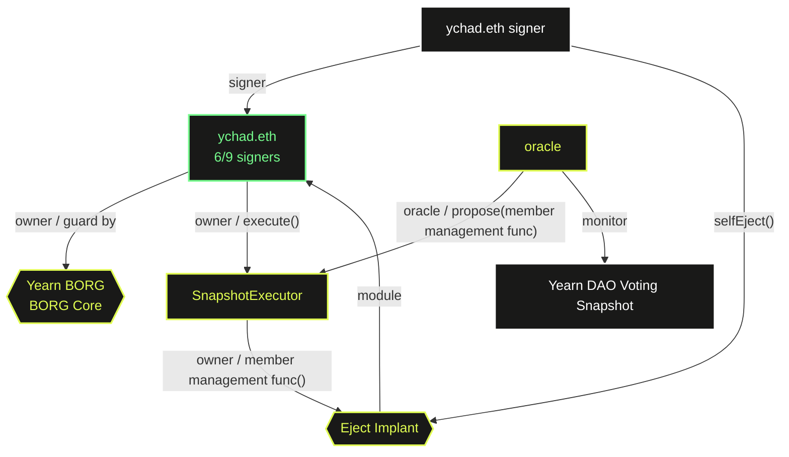

# Yearn BORG

## BORG Architectures



## Member Management Workflow

1. Action is initiated on the MetaLeX OS webapp
2. A Snapshot proposal will be submitted via API using Yearn's existing voting settings
3. MetaLeX's Snapshot oracle will submit the results onchain to an executor contract, which will have the proposed transaction pending for co-approval
4. ychad.eth will submit co-approval / execute the action through the MetaLeX OS webapp

## Deployment

1. Run the deploy script
   ```bash
   forge script scripts/yearnBorg.s.sol --rpc-url <RPC URL> --optimize --optimizer-runs 200 --use solc:0.8.20 --via-ir --broadcast
   ```

2. If got the following errors, force clean the cache with flag `--force`
   ```
   Error: buffer overrun while deserializing
   ```

## Tests

### Integration Tests

Test the deployment scripts and verify the results.

```bash
forge test --optimize --optimizer-runs 200 --use solc:0.8.20 --via-ir --fork-url <eth-mainnet-archive-endpoint> --fork-block-number 22268905 --mc YearnBorgTest   
```

### Acceptance Tests

Verify the specified deployment results.

```bash
forge test --optimize --optimizer-runs 200 --use solc:0.8.20 --via-ir --fork-url <eth-mainnet-archive-endpoint> --fork-block-number <deployment-block-number> --mc YearnBorgAcceptanceTest   
```
