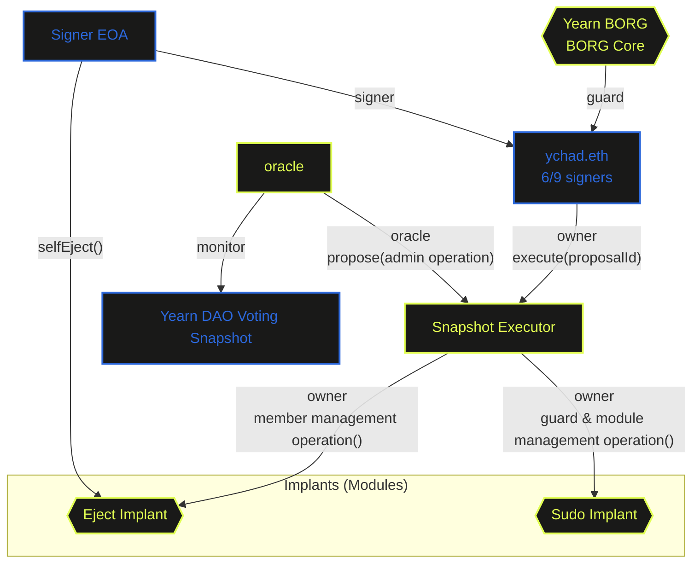

# Yearn BORG

## BORG Architectures

| Entity            | Descriptions                                                                                                                 |
|-------------------|------------------------------------------------------------------------------------------------------------------------------|
| BORG Core         | A Safe Guard contract restricting `ychad.eth`'s administrative authority                                                     |
| Eject Implant     | A Safe Module contract for `ychad.eth` member management, integrated with Snapshot Executor to enforce DAO co-approval       |
| Sudo Implant      | A Safe Module contract for `ychad.eth` Guard/Module management, integrated with Snapshot Executor to enforce DAO co-approval |
| Snapshot Executor | A smart contract enabling co-approval between a DAO and `ychad.eth`                                                          |
| oracle            | A MetaLex service for coordinating Yearn Snapshot voting and recording results on-chain                                      |



## Initial BORGing of ychad

To implement the BORG, ychad unilaterally: 
- determines initial signer set (i.e., keep existing signers)
- approves/adopts legal agreements (Cayman Foundation)
- installs SAFE modules (BORG implants) and guard (BORG core)

If desired, can seek prior DAO social approval for these changes (and this is likely best for legitimacy), but no DAO onchain actions or legal actions are required. 

## Restricted Admin Operations

Once ychad is "BORGed", the following actions will require bilateral approval of the DAO and ychad. Onchain, this means 'blacklisting' certain unilateral SAFE operations that would otherwise be possible, instead requiring DAO/ychad co-approval of such actions:

- Add / remove / swap signers / change threshold
- Add / disable Modules
- Set Guards

### Co-approval Workflows

The process for bilateral `ychad.eth` / DAO approvals will be as follows:

1. Operation is initiated on the MetaLeX OS webapp [can snapshot's UI also be used as a fallback option?]
2. A Snapshot proposal will be submitted via API using Yearn's existing voting settings
3. MetaLeX's Snapshot oracle (`oracle`) will submit the results on-chain to an executor contract (`Snapshot Executor`), which will have the proposed transaction pending for co-approval [let's discuss fallback options if our oracle were to go offline, let's discuss security measures around oracle]
4. After a waiting period, `ychad.eth` can co-approve it by executing the operation through the MetaLeX OS webapp
5. After an extra waiting period, anyone can cancel the proposal if it hasn't been executed

This essentially means that ychad cannot 'breach' its basic 'agreement' with the DAO by changing the meta-governance rules (ychad signer membership, ychad approval threshold). It also adds an extra security layer as ychad members cannot collude to change these fundamental rules. All other operations would remain under ychad's sole discretion. 

### Future On-chain Governance Transition

Yearn's Snapshot governance will be replaced with an on-chain governance at some point (ex. `YearnGovExecutor`).
`YearnGovExecutor` (or its adapter) must satisfy the following requirements to integrate with the co-approval process:
- Each proposal must include generic transaction fields (`target`, `value`, `calldata` or their equivalents) to enable `YearnGovExecutor` to execute the proposal upon approval
- Proposals involving `ychad.eth` [Restricted Admin Operations](#restricted-admin-operations) must be executed solely by `ychad.eth` to enforce co-approval requirements

The transition process from Snapshot to on-chain governance is listed as follows:

1. A final Snapshot proposal will be submitted to replace `Snapshot Executor` with `YearnGovExecutor` by transferring ownership of `SudoImplant` and `EjectImplant` to `YearnGovExecutor`
2. Once co-approved and executed by `ychad.eth`, the transition process is complete

After the transition, the co-approval process will become:

1. Operation is initiated on the MetaLeX OS webapp [discuss fallback options]
2. An on-chain proposal will be submitted to `YearnGovExecutor`
3. Once the vote passed, `ychad.eth` will co-approve it by executing the operation through the MetaLeX OS webapp [discuss fallback options]

### Module Addition

New Modules grant `ychad.eth` privileges to bypass Guards restrictions, therefore it requires DAO co-approval via [Co-approval Workflows](#co-approval-workflows).

### Guard & Module Removal

In exceptional circumstances, `ychad.eth` can propose the removal of the Guard via [Co-approval Workflows](#co-approval-workflows).
Upon DAO co-approval and execution, `ychad.eth` will no longer face any restriction on administrative operations.

**⚠️ Warning**: Disabling a Module revokes `ychad.eth`'s privileges. In particular, disabling `SudoImplant` will permanently eliminate `ychad.eth`'s ability to add new Modules or remove Guards. [discuss]

## Member Self-resignation

A `ychad.eth` member can unilaterally resign by calling `EjectImplant.selfEject(false)` without approval. The Safe contract ensures threshold validity. 
Alternatively, the member can call `EjectImplant.selfEject(true)` to resign and simultaneously reduce the threshold by 1 [wouldn't this require DAO co-approval as well since threshold is being changed?]

## Key Parameters

| ID                             | Value      | Descriptions                                            |
|--------------------------------|------------|---------------------------------------------------------|
| `borgIdentifier`               | Yearn BORG | BORG name                                               |
| `borgMode`                     | blacklist  | Every operation is allowed unless blacklisted           |
| `borgType`                     | 3          |                                                         |
| `snapShotWaitingPeriod`        | 3 days     | Waiting period before a proposal can be executed        |
| `snapShotCancelPeriod`         | 2 days     | Extra waiting period before a proposal can be cancelled |
| `snapShotPendingProposalLimit` | 3          | Maximum pending proposals                               |
| `oracle`                       | `address`  | MetaLeX Snapshot oracle                                 |

## Deployment

1. Run the deploy script
   ```bash
   forge script scripts/yearnBorg.s.sol --rpc-url <RPC URL> --optimize --optimizer-runs 200 --use solc:0.8.20 --via-ir --broadcast
   ```

2. If got the following errors, force clean the cache with flag `--force`
   ```
   Error: buffer overrun while deserializing
   ```      
   
3. Take notes of the output Safe TXs (for setting guard & adding modules), for examples:
   ```
   Safe TXs:
    # 0
      to: 0xFEB4acf3df3cDEA7399794D0869ef76A6EfAff52
      value: 0
      data:
   0x610b59250000000000000000000000006faa027c062868424287af2faef3ddaca802bff7

    # 1
      to: 0xFEB4acf3df3cDEA7399794D0869ef76A6EfAff52
      value: 0
      data:
   0x610b5925000000000000000000000000a21f6d7aa0b320b8669caef53f790b1a2ac838d7
   
    # 2
      to: 0xFEB4acf3df3cDEA7399794D0869ef76A6EfAff52
      value: 0
      data:
   0xe19a9dd9000000000000000000000000bc19387f5b8ae73fad41cd2294f928a735c60534
   ```   
4. Ask `ychad.eth` to sign and execute the Safe TXs 

## Tests

### Integration Tests

Test the deployment scripts and verify the results.

```bash
forge test --optimize --optimizer-runs 200 --use solc:0.8.20 --via-ir --fork-url <eth-mainnet-archive-endpoint> --fork-block-number 22268905 --mc YearnBorgTest   
```

### Acceptance Tests

Verify a specific deployment results.

```bash
forge test --optimize --optimizer-runs 200 --use solc:0.8.20 --via-ir --fork-url <eth-mainnet-archive-endpoint> --fork-block-number <deployment-block-number> --mc YearnBorgAcceptanceTest   
```
