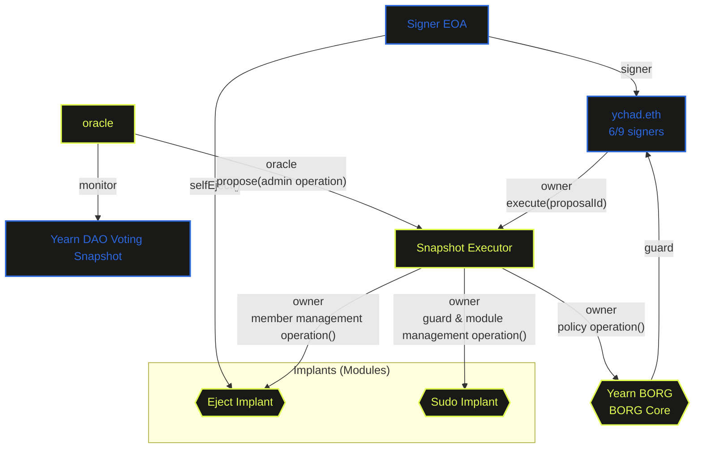

# Yearn BORG

## BORG Architectures

| Entity            | Descriptions                                                                                                                                                                |
|-------------------|-----------------------------------------------------------------------------------------------------------------------------------------------------------------------------|
| BORG Core         | A Safe Guard contract restricting ychad's administrative authority                                                                                                          |
| Eject Implant     | A Safe Module contract for ychad member management, integrated with Snapshot Executor to enforce DAO co-approval                                                            |
| Sudo Implant      | A Safe Module contract for ychad Guard/Module management, integrated with Snapshot Executor to enforce DAO co-approval                                                      |
| Snapshot Executor | A smart contract enabling co-approval between a DAO and ychad                                                                                                               |
| oracle            | A MetaLex service for coordinating Yearn Snapshot voting and recording results on-chain. It is set to be replaced by Yearn's own on-chain governance contract in the future |


```mermaid
graph TD
    ychad[ychad.eth<br/>6/9 signers]
    ychadSigner[Signer EOA]
    yearnDaoVoting[Yearn DAO Voting Snapshot]
    
    oracleAddr[oracle]
    
    borg{{Yearn BORG<br>BORG Core}}

    subgraph implants["Implants (Modules)"]
        ejectImplant{{Eject Implant}}
        sudoImplant{{Sudo Implant}}
    end
     
    snapshotExecutor[Snapshot Executor]
    
    borg -->|"guard"| ychad

    
    %% implants -->|modules| ychad
    
    ychadSigner -->|signer| ychad
    ychadSigner -->|"selfEject()"| ejectImplant

    oracleAddr -->|"oracle<br>propose(admin operation)"| snapshotExecutor      
    oracleAddr -->|monitor| yearnDaoVoting
    
    ychad -->|"owner<br>execute(proposalId)"| snapshotExecutor
    
    snapshotExecutor -->|"owner<br>policy operation()"| borg
    snapshotExecutor -->|"owner<br>guard & module management operation()"| sudoImplant
    snapshotExecutor -->|"owner<br>member management operation()"| ejectImplant
    
    %% Styling (optional, Mermaid supports limited styling)
    classDef default fill:#191918,stroke:#fff,stroke-width:2px,color:#fff;
    classDef borg fill:#191918,stroke:#E1FE52,stroke-width:2px,color:#E1FE52;
    classDef yearn fill:#191918,stroke:#2C68DB,stroke-width:2px,color:#2C68DB;
    classDef safe fill:#191918,stroke:#76FB8D,stroke-width:2px,color:#76FB8D;
    classDef todo fill:#191918,stroke:#F09B4A,stroke-width:2px,color:#F09B4A;
    class borg borg;
    class ejectImplant borg;
    class sudoImplant borg;
    class snapshotExecutor borg;
    class oracleAddr borg;
    class ychad yearn;
    class ychadSigner yearn;
    class yearnDaoVoting yearn;
```

## Initial BORGing of ychad

To implement the BORG, ychad unilaterally: 
- determines initial signer set (i.e., keep existing signers)
- approves/adopts legal agreements (Cayman Foundation)
- installs SAFE modules (BORG implants) and guard (BORG core)

If desired, can seek prior DAO social approval for these changes (and this is likely best for legitimacy), but no DAO onchain actions or legal actions are required. 

## Restricted Admin Operations

Once ychad is "BORGed", the following operations will require bilateral approval of the DAO and ychad. Onchain, this means 'blacklisting' certain unilateral SAFE operations that would otherwise be possible, instead requiring DAO/ychad co-approval of such actions:

- Add / remove / swap signers / change threshold
- Add / disable Modules
- Set Guards

### Co-approval Workflows

The process for bilateral ychad / DAO approvals will be as follows:

1. Operation is initiated on the MetaLeX OS webapp
2. A Snapshot proposal will be submitted via API using Yearn's existing voting settings
3. MetaLeX's Snapshot oracle (`oracle`) will submit the results on-chain to an executor contract (`Snapshot Executor`), which will have the proposed transaction pending for co-approval
4. After a waiting period, ychad can co-approve it by executing the operation through the MetaLeX OS webapp
5. After an extra waiting period, anyone can cancel the proposal if it hasn't been executed

This essentially means that ychad cannot 'breach' its basic 'agreement' with the DAO by changing the meta-governance rules (ychad signer membership, ychad approval threshold). It also adds an extra security layer as ychad members cannot collude to change these fundamental rules. All other operations would remain under ychad's sole discretion. 

### Future On-chain Governance Transition

Yearn's Snapshot governance will be replaced with an on-chain governance at some point (ex. `YearnGovExecutor`). 
Technically, the transition is done by having `YearnGovExecutor` serve as the new `oracle`.
Therefore, `YearnGovernance` must meet the following requirements: 

- `YearnGovernance` can call `SnapShotExecutor.propose(target, value, cdata, description)`, which contains the instructions of the admin operation

The transition process from Snapshot to on-chain governance is listed as follows:

1. A final Snapshot proposal will be submitted to assign `YearnGovExecutor` as the new oracle of `Snapshot Executor`
2. Once co-approved and executed by ychad, the transition process is complete

After the transition, the co-approval process will become:

1. Operation is initiated on the MetaLeX OS webapp, or, alternatively, through a third-party UI if the calldata is prepared
2. An on-chain proposal will be submitted to `YearnGovExecutor`
3. Once the vote passed, `YearnGovExecutor` will propose the results to the executor contract (`Snapshot Executor`), which will have the proposed transaction pending for co-approval
4. After a waiting period, ychad can co-approve it by executing the operation through the MetaLeX OS webapp
5. After an extra waiting period, anyone can cancel the proposal if it hasn't been executed

### Module Addition

New Modules grant ychad privileges to bypass Guards restrictions, therefore it requires DAO co-approval via [Co-approval Workflows](#co-approval-workflows).

### Guard & Module Updates

In exceptional circumstances, ychad can propose the removal of the Guard via [Co-approval Workflows](#co-approval-workflows).
Upon DAO co-approval and execution, ychad will no longer face any restriction on administrative operations.

Likewise, ychad can propose adding or removing Modules through [Co-approval Workflows](#co-approval-workflows) as well. 
For safety, it cannot remove the `SudoImplant` Module itself.

## Member Self-resignation

A ychad member can unilaterally resign by calling `EjectImplant.selfEject(false)` without approval. The Safe contract ensures threshold validity.
Members are prohibited from calling `EjectImplant.selfEject(true)` as it would alter the multisig threshold. Consequently, they cannot self-resign when the remaining member count equals the threshold.

## Restricted Advanced Operations

Once ychad is "BORGed," the following operations are restricted for security reasons unless explicitly whitelisted:

- Transactions executed in `DelegateCall` mode

However, to ensure a seamless user experience, commonly used advanced operations are preemptively whitelisted, including:

- Batch Transactions (via `MultiSendCallOnly`)

Note: `MultiSendCallOnly` is whitelisted, but `MultiSend` is not, as it permits arbitrary `delegatecall`, posing security risks.
Operations relying on `MultiSend`, such as manual fund distributions, can typically be performed using safer alternatives, like custom vetted contracts.

## Key Parameters

| ID                             | Value      | Descriptions                                                                                                               |
|--------------------------------|------------|----------------------------------------------------------------------------------------------------------------------------|
| `borgIdentifier`               | Yearn BORG | BORG name                                                                                                                  |
| `borgMode`                     | blacklist  | Every operation is allowed unless blacklisted                                                                              |
| `borgType`                     | 3          | Dev BORG                                                                                                                   |
| `snapShotWaitingPeriod`        | 3 days     | Waiting period before a proposal can be executed                                                                           |
| `snapShotCancelPeriod`         | 7 days     | Extra waiting period before a proposal can be cancelled                                                                    |
| `snapShotPendingProposalLimit` | 3          | Maximum pending proposals                                                                                                  |
| `snapShotTtl`                  | 30 days    | Duration of inactivity before an oracle is deemed expired and can be replaced by ychad                                     |
| `oracle`                       | `address`  | MetaLeX Snapshot oracle (or Yearn on-chain governance contract after [transition](#future-on-chain-governance-transition)) |

## Deployment

1. Build all contracts with deploy script as the entrypoint.
   This step is crucial to ensure consistent bytecodes across deployment and later verification, as they depend on
   the compilation entrypoint (due to `--via-ir`)
   ```bash
   forge build --optimize --optimizer-runs 200 --use solc:0.8.20 --via-ir scripts/yearnBorg.s.sol
   ```

2. Run the deploy script (and verify it on Etherscan if possible)
   ```bash
   # Note the example uses Basescan
   forge script scripts/yearnBorg.s.sol --rpc-url <RPC URL> --optimize --optimizer-runs 200 --use solc:0.8.20 --via-ir --tc YearnBorgDeployScript --etherscan-api-key $ETHERSCAN_API_KEY --verifier-url https://api.basescan.org/api --broadcast --verify
   ```

3. If got the following errors, clean all cache `rm -rf cache out` and redo from step 1
   ```
   Error: buffer overrun while deserializing
   ```

4. Take notes of the output Safe TXs (for setting guard & adding modules), for examples:
   ```
   Safe TXs:
    # 0
      to: 0xFEB4acf3df3cDEA7399794D0869ef76A6EfAff52
      value: 0
      data:
   0x610b59250000000000000000000000006faa027c062868424287af2faef3ddaca802bff7

    # 1
      to: 0xFEB4acf3df3cDEA7399794D0869ef76A6EfAff52
      value: 0
      data:
   0x610b5925000000000000000000000000a21f6d7aa0b320b8669caef53f790b1a2ac838d7
   
    # 2
      to: 0xFEB4acf3df3cDEA7399794D0869ef76A6EfAff52
      value: 0
      data:
   0xe19a9dd9000000000000000000000000bc19387f5b8ae73fad41cd2294f928a735c60534
   ```    

5. Some of the contract verification may fail due to the aforementioned bytecode inconsistency. Manually verify them with the complete standard-json-input
   ```bash
   # `forge verify-contract` wouldn't work even though it uses Etherscan API under the hood.
   # It is due to its hard-coded use of same contract name for generating standard-json-input and submission,
   # while our hack needs separate names: scripts/yearnBorg.s.sol:YearnBorgDeployScript for generating standard-json-input 
   # and src/borgCore.sol:borgCore for submission.
   
   # Therefore, we create the standard-json-input and call Etherscan API in two separate steps
   forge verify-contract --watch --optimizer-runs 200 --compiler-version 'v0.8.20+commit.a1b79de6' --via-ir --chain-id 8453 --verifier etherscan --etherscan-api-key $ETHERSCAN_API_KEY --verifier-url https://api.basescan.org/api --constructor-args $(cast abi-encode 'constructor(address,uint256,uint8,string,address)' 0x558176a9c86E8B35F72C6dde732035887f902E2d 3 1 'Yearn BORG' 0xFEB4acf3df3cDEA7399794D0869ef76A6EfAff52) -vvv --show-standard-json-input 0xe1c90a1f8a9553b31110dd6feead76e79a6ed419 'scripts/yearnBorg.s.sol:YearnBorgDeployScript' > standard-json-input.json
   curl --location 'https://api.basescan.org/api' \
     --form 'apikey="<my-basescan-api-key>"' \
     --form 'sourceCode="<content-of-standard-json-input.json>"' \
     --form 'contractaddress="0x0c05BF611b4f3769e8BF3714C0AEedb965BEA40C"' \
     --form 'codeformat="solidity-standard-json-input"' \
     --form 'contractname="src/borgCore.sol:borgCore"' \
     --form 'compilerversion="v0.8.20+commit.a1b79de6"' \
     --form 'chainId="8453"' \
     --form 'constructorArguements="0000000000000000000000003068979c38f387d9abda98143645f5061abdeb3d0000000000000000000000000000000000000000000000000000000000000003000000000000000000000000000000000000000000000000000000000000000100000000000000000000000000000000000000000000000000000000000000a0000000000000000000000000feb4acf3df3cdea7399794d0869ef76a6efaff52000000000000000000000000000000000000000000000000000000000000000a596561726e20424f524700000000000000000000000000000000000000000000"' \
     --form 'module="contract"' \
     --form 'action="verifysourcecode"'
   ```

6. Ask ychad to sign and execute the Safe TXs 

## Tests

### Integration Tests

Test the deployment scripts and verify the results.

```bash
forge test --optimize --optimizer-runs 200 --use solc:0.8.20 --via-ir --fork-url <eth-mainnet-archive-endpoint> --fork-block-number 22268905 --mc YearnBorgTest   
```

### Acceptance Tests

Verify a specific deployment results.

```bash
forge test --optimize --optimizer-runs 200 --use solc:0.8.20 --via-ir --fork-url <eth-mainnet-archive-endpoint> --fork-block-number <deployment-block-number> --mc YearnBorgAcceptanceTest   
```
