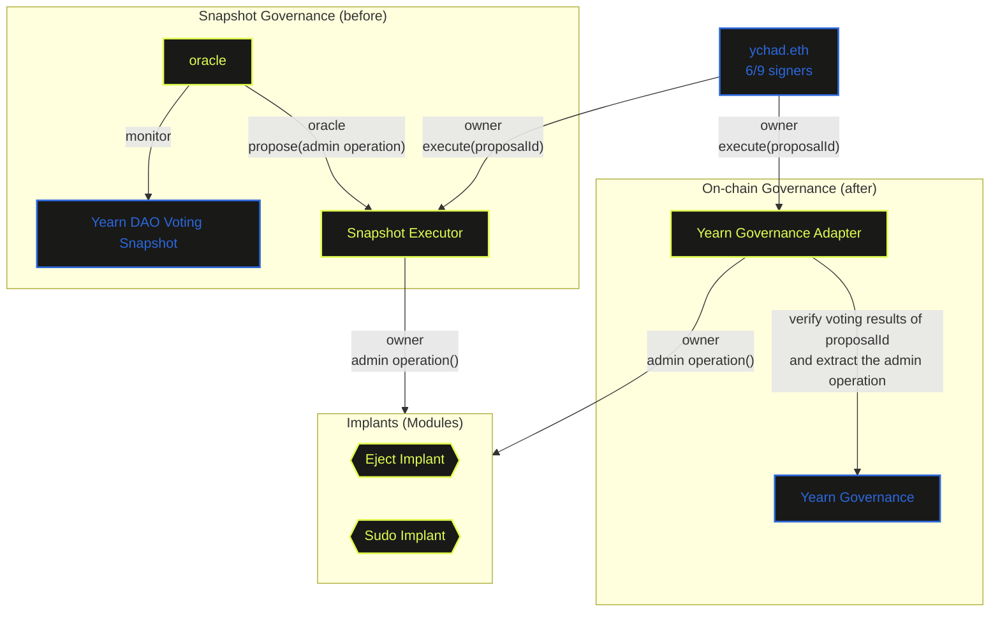

# Yearn BORG

## BORG Architectures

| Entity            | Descriptions                                                                                                                 |
|-------------------|------------------------------------------------------------------------------------------------------------------------------|
| BORG Core         | A Safe Guard contract restricting `ychad.eth`'s administrative authority                                                     |
| Eject Implant     | A Safe Module contract for `ychad.eth` member management, integrated with Snapshot Executor to enforce DAO co-approval       |
| Sudo Implant      | A Safe Module contract for `ychad.eth` Guard/Module management, integrated with Snapshot Executor to enforce DAO co-approval |
| Snapshot Executor | A smart contract enabling co-approval between a DAO and `ychad.eth`                                                          |
| oracle            | A MetaLex service for coordinating Yearn Snapshot voting and recording results on-chain                                      |


## Restricted Admin Operations

`ychad.eth` will be prohibited from unilaterally performing the following admin operations:

- Add / remove / swap signers / change threshold
- Add / disable Modules
- Set Guards

### Co-approval Workflows

Except existing signers, Modules (BORG Implants), Guard (BORG Core) and its set rules,
all coming operations listed above will require approval of both `ychad.eth` and DAO, with a process as such:

1. Operation is initiated on the MetaLeX OS webapp
2. A Snapshot proposal will be submitted via API using Yearn's existing voting settings
3. MetaLeX's Snapshot oracle (`oracle`) will submit the results on-chain to an executor contract (`Snapshot Executor`), which will have the proposed transaction pending for co-approval
4. After a waiting period, `ychad.eth` can co-approve it by executing the operation through the MetaLeX OS webapp
5. After an extra waiting period, anyone can cancel the proposal if it hasn't been executed

### Future On-chain Governance Transition

Yearn's Snapshot-based governance will transition to an on-chain governance system (ex. `YearnGovernance`). 
An adapter (`YearnGovernanceAdapter`) will be implemented by MetaLex to manage the implementation details on co-approval process. 
To integrate successfully, `YearnGovernance` must meet the following requirements:

- Each proposal has an unique ID (ex. `proposalId`)
- `YearnGovernanceAdapter` can read the proposal's voting result and verify it is passed
- `YearnGovernanceAdapter` can extract the admin operation (ex. `target`, `value`, `calldata` or equivalent) from the proposal

The transition process from Snapshot to on-chain governance is listed as follows:

1. A final Snapshot proposal will be submitted to grant `YearnGovernanceAdapter` ownership of the implants 
2. `ychad.eth` to co-approved and executed the proposal
3. The first on-chain proposal will be submitted to revoke `SnapShotExecutor` ownership of the implants
4. `ychad.eth` to co-approved and executed the proposal. The transition is now complete

After the transition, the co-approval process will become:

1. Operation is initiated on the MetaLeX OS webapp
2. An on-chain proposal will be submitted to `YearnGovExecutor`
3. Once the vote passed, `ychad.eth` will co-approve it by executing the operation through the MetaLeX OS webapp

Below shows the changes of BORG architectures before/after on-chain governance transition:



### Module Addition

New Modules grant `ychad.eth` privileges to bypass Guards restrictions, therefore it requires DAO co-approval via [Co-approval Workflows](#co-approval-workflows).

### Guard & Module Removal

In exceptional circumstances, `ychad.eth` can propose the removal of the Guard via [Co-approval Workflows](#co-approval-workflows).
Upon DAO co-approval and execution, `ychad.eth` will no longer face any restriction on administrative operations.

**⚠️ Warning**: Disabling a Module revokes `ychad.eth`'s priviledges. In particular, disabling `SudoImplant` will permanently eliminate `ychad.eth`'s ability to add new Modules or remove Guards.

## Member Self-resignation

A `ychad.eth` member can unilaterally resign by calling `EjectImplant.selfEject(false)` without approval. The Safe contract ensures threshold validity. 
Alternatively, the member can call `EjectImplant.selfEject(true)` to resign and simultaneously reduce the threshold by 1

## Key Parameters

| ID                             | Value      | Descriptions                                            |
|--------------------------------|------------|---------------------------------------------------------|
| `borgIdentifier`               | Yearn BORG | BORG name                                               |
| `borgMode`                     | blacklist  | Every operation is allowed unless blacklisted           |
| `borgType`                     | 3          |                                                         |
| `snapShotWaitingPeriod`        | 3 days     | Waiting period before a proposal can be executed        |
| `snapShotCancelPeriod`         | 2 days     | Extra waiting period before a proposal can be cancelled |
| `snapShotPendingProposalLimit` | 3          | Maximum pending proposals                               |
| `oracle`                       | `address`  | MetaLeX Snapshot oracle                                 |

## Deployment

1. Run the deploy script
   ```bash
   forge script scripts/yearnBorg.s.sol --rpc-url <RPC URL> --optimize --optimizer-runs 200 --use solc:0.8.20 --via-ir --broadcast
   ```

2. If got the following errors, force clean the cache with flag `--force`
   ```
   Error: buffer overrun while deserializing
   ```      
   
3. Take notes of the output Safe TXs (for setting guard & adding modules), for examples:
   ```
   Safe TXs:
    # 0
      to: 0xFEB4acf3df3cDEA7399794D0869ef76A6EfAff52
      value: 0
      data:
   0x610b59250000000000000000000000006faa027c062868424287af2faef3ddaca802bff7

    # 1
      to: 0xFEB4acf3df3cDEA7399794D0869ef76A6EfAff52
      value: 0
      data:
   0x610b5925000000000000000000000000a21f6d7aa0b320b8669caef53f790b1a2ac838d7
   
    # 2
      to: 0xFEB4acf3df3cDEA7399794D0869ef76A6EfAff52
      value: 0
      data:
   0xe19a9dd9000000000000000000000000bc19387f5b8ae73fad41cd2294f928a735c60534
   ```   
4. Ask `ychad.eth` to sign and execute the Safe TXs 

## Tests

### Integration Tests

Test the deployment scripts and verify the results.

```bash
forge test --optimize --optimizer-runs 200 --use solc:0.8.20 --via-ir --fork-url <eth-mainnet-archive-endpoint> --fork-block-number 22268905 --mc YearnBorgTest   
```

### Acceptance Tests

Verify a specific deployment results.

```bash
forge test --optimize --optimizer-runs 200 --use solc:0.8.20 --via-ir --fork-url <eth-mainnet-archive-endpoint> --fork-block-number <deployment-block-number> --mc YearnBorgAcceptanceTest   
```
